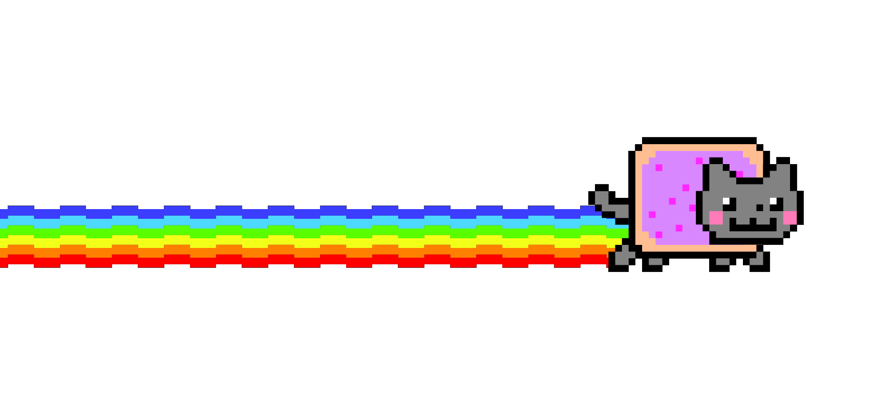

<h3 align="center">
  Hey there!
</h3>

<div align="center">
  I'm just a junior developer who is <big><b>currently</b></big> learning the
  basics. I love to read and learn about different ways of creating things using
  computers.
</div>

<hr />

<div align="center">
  <h5 align="center">Skills</h5>
  
  
  
  <h6 align="center">Notes</h6>
  <a href="https://github.com/MahdiDavoodi/Notes" target="blank"
    ></a>
  <a href="https://github.com/MahdiDavoodi/ProblemSolving" target="blank"
    ></a>
  <a href="https://github.com/MahdiDavoodi/Android" target="blank"
    ></a>
  <a href="https://github.com/MahdiDavoodi/Kotlin" target="blank"
    ></a>
  <a href="https://github.com/MahdiDavoodi/HTML-CSS" target="blank"
    ></a>
  <a href="https://github.com/MahdiDavoodi/Git" target="blank"
    ></a>
</div>

<hr />

<h3>🌎 Bio</h3>

```kotlin
class Mahdi(private val lastName: String, var age: Int) {
    var skills = listOf<String>()
    var currentlyLearning = ""
    var loves = listOf<String>()
}

fun main() {
    val me = Mahdi("Davoodi", 18)
    me.skills = listOf("Java", "Kotlin", "Android", "Git / GitHub")
    me.currentlyLearning = "HTML"
    me.loves = listOf("Family and friends", "Programming", "Music")

    println("What about you?")
}
```

<h3>🛠 System</h3>

```
💾 OS     ~  Ubuntu 20.4 LTS
💻 Host   ~  HP
💽 Shell  ~  bash 5.0.17
```

<h3>📈 Interesting numbers</h3>

<div>
  <p align="left">
    &nbsp;
  </p>
</div>

<div>
  
</div>

<div>
  
</div>

<h3>🎶 Vibing to</h3>
<a href="https://open.spotify.com/user/dl3rgkrwco194cm2lynildhle">
  
</a>

<div>
  
</div>
